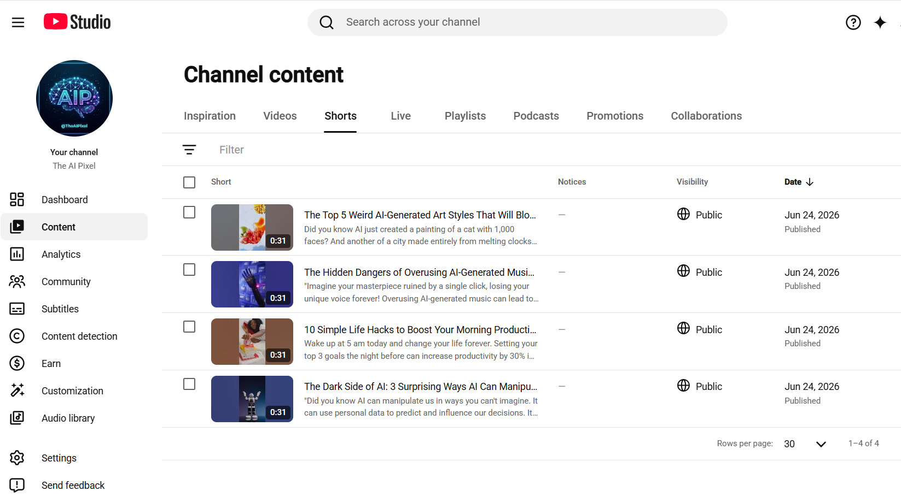
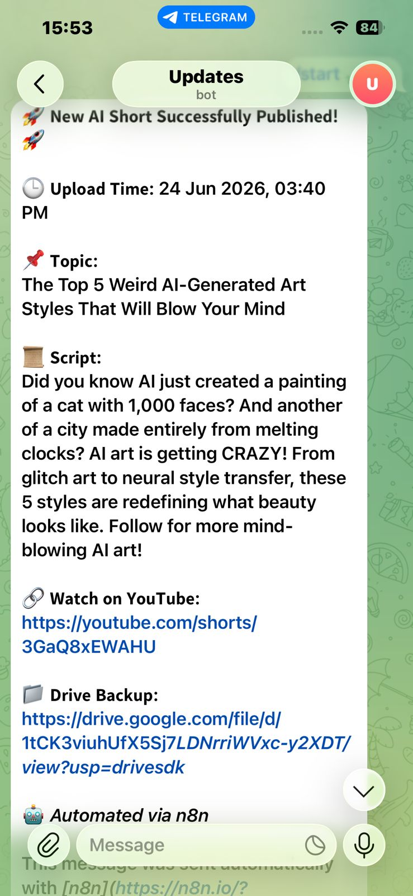
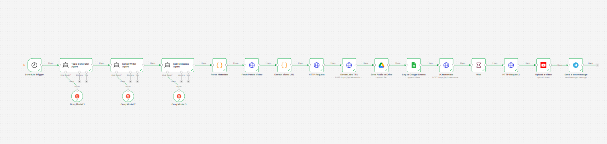
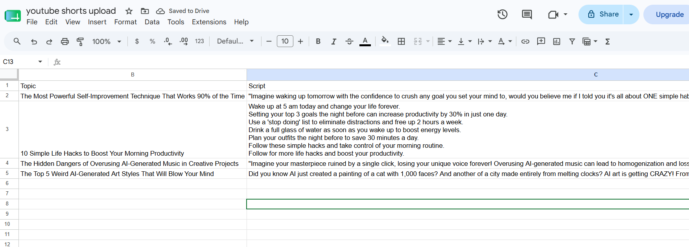
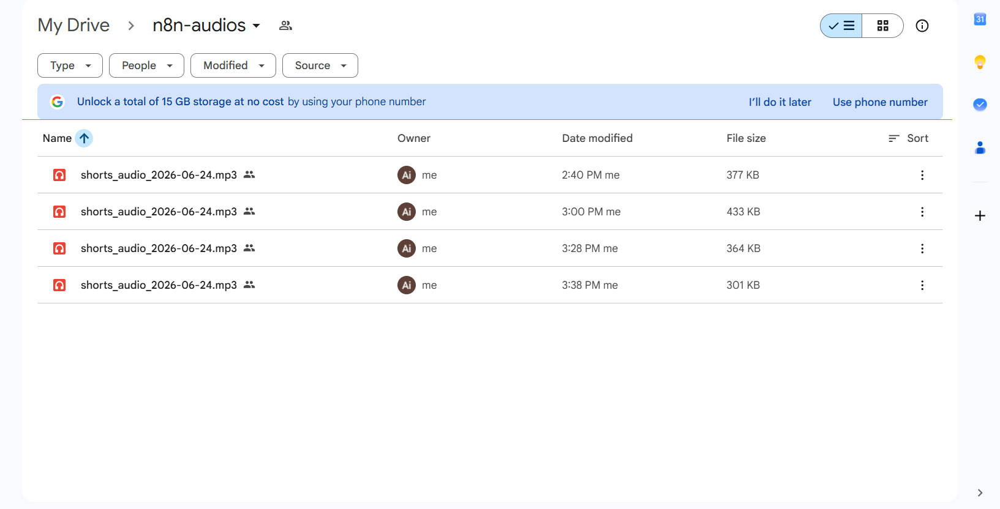

<div align="center">

# 🎬 AI YouTube Shorts Automation System

### *From Zero to Published — Fully Automated, Zero Human Involvement*


**4 Shorts Auto-Published on Day 1 — Built in Under 24 Hours**

</div>

---

## 🚀 What This System Does

This is not a demo. This is a **production-level content automation pipeline** that wakes up every day at a scheduled time, thinks of a topic, writes a script, records a voiceover, finds a video, edits everything together, and publishes a YouTube Short — all without me touching anything.

Every single step that a human content creator does manually — ideation, scripting, SEO, voiceover, video editing, uploading — this system does automatically.

---

## 🖼️ Proof It Works

### YouTube Studio — 4 Shorts Published on Day 1


### Telegram — Live Notification After Every Upload


### n8n — Full 16-Node Workflow Canvas


### Google Sheets — Automatic Content Log


### Google Drive — Audio Backup Folder


---

## 🧠 System Architecture — 5 Phases, 16 Nodes

The entire pipeline is divided into 5 intelligent phases. Each phase has a specific job and passes its output to the next one automatically.

---

### Phase 1 — The AI Brain 🧠
*This phase is the creative director of the channel*

**Schedule Trigger**
The ignition switch of the entire system. Set it once — it fires automatically every day at the configured time. No alarms, no manual clicks, nothing.

**Topic Generator Agent — Groq LLM**
The first AI agent that decides what today's video will be about. It thinks like a content strategist — picking topics that are trending, engaging, and relevant to the channel niche.

**Script Writer Agent — Groq LLM**
Once the topic is decided, this agent writes the complete Short script. The script is designed to hook the viewer in the first 3 seconds, deliver value fast, and end with a call to action — all within 30 seconds of read time.

**SEO Metadata Agent — Groq LLM**
This agent reads the final script and generates everything YouTube needs to rank the video — a viral title, keyword-rich description, and relevant hashtags. Pure SEO, automated.

**Parse Metadata — Code Node**
The AI returns everything in JSON format. This node cleans and separates that data so every downstream node gets exactly what it needs — title here, tags there, script separately.

---

### Phase 2 — The Production House 🎬
*This phase sources all media assets*

**Fetch Pexels Video — HTTP Request**
Hits the Pexels API with the video topic as a search query and retrieves a list of high-quality, royalty-free stock videos that match the content.

**Extract Video URL — Code Node**
Pexels returns a large JSON object with multiple video qualities. This node intelligently picks the best quality `.mp4` link and passes only that forward.

**Download Video — HTTP Request**
Goes to that direct link and downloads the actual video file into the n8n workflow memory for processing.

**ElevenLabs TTS — HTTP Request**
The professional voiceover artist. Takes the Groq-written script and sends it to ElevenLabs, which returns a studio-quality, human-like audio file — no robotic voice, no text-to-speech artifacts.

---

### Phase 3 — The Memory & Backup 🗄️
*This phase makes sure nothing is ever lost*

**Save Audio to Drive — Google Drive**
Every generated audio and video file is automatically backed up to a dedicated Google Drive folder (`n8n-audios`). The Drive link is sent in the Telegram notification so the file is always accessible.

**Log to Google Sheets — Google Sheets**
Every execution is logged — Date, Topic, Script, YouTube Title, Description, Tags, and Drive links — all saved automatically. A complete content archive builds itself over time.

---

### Phase 4 — The Video Editor 🎞️
*This is where the magic happens — raw assets become a finished Short*

**Creatomate — HTTP Request**
The video editor of the pipeline. It receives the Pexels stock video, the ElevenLabs voiceover audio, and the script text. Using a pre-configured template, it merges the video and audio together and dynamically burns **auto-captions** onto the screen — making the Short accessible, engaging, and algorithm-friendly.

**Wait Node**
Video rendering takes time. This node pauses the workflow for a set duration to let Creatomate finish rendering before the next node tries to fetch the output — preventing timing errors completely.

**Fetch Final Video — HTTP Request**
After the wait, this node goes back to Creatomate, confirms the render is complete, and downloads the final fully-edited `.mp4` file — ready for YouTube.

---

### Phase 5 — The Publisher 🚀
*This phase delivers the content to the world*

**Upload a Video — YouTube Data API v3**
Takes the final video file along with the AI-generated title, description, and tags — and publishes it directly to YouTube as a Short. Public. Live. Done.

**Send a Text Message — Telegram Bot**
The moment the video goes live, a beautifully formatted Telegram notification fires with the Upload Time, Topic, Script, YouTube link, and Drive backup link — all in one message.

---

## 🛠️ Tech Stack

| Tool | Purpose | Cost |
|------|---------|------|
| n8n (Self Hosted) | Core automation engine — all 16 nodes | Free |
| Groq LLM (llama3-70b) | Topic generation, script writing, SEO | Free |
| Pexels API | Royalty-free stock video sourcing | Free |
| ElevenLabs | Human-like AI voiceover generation | Free (10k chars/month) |
| Creatomate | Video + audio merging + auto-captions | Trial |
| YouTube Data API v3 | Direct video upload to channel | Free |
| Google Drive API | Cloud backup for all generated files | Free |
| Google Sheets API | Automatic content logging and tracking | Free |
| Telegram Bot API | Real-time upload notifications | Free |

---

## ✨ What Makes This Different

Most automation projects are tutorials or demos. This one is different:

- **Actually published videos** — 4 Shorts went live on YouTube on Day 1
- **Self-hosted n8n with HTTPS** — not a cloud trial, a real server with SSL
- **9 APIs connected** — each one doing a specific job in the pipeline
- **Auto-captions** — most automation skips this; this system adds them automatically
- **Complete backup system** — Drive + Sheets means no content is ever lost
- **Built in under 24 hours** — from idea to 4 published videos in one day

---

## 📊 Day 1 Results

| Short Title | Status | Date |
|-------------|--------|------|
| The Top 5 Weird AI-Generated Art Styles That Will Blow Your Mind | ✅ Published | Jun 24, 2026 |
| The Hidden Dangers of Overusing AI-Generated Music in Creative Projects | ✅ Published | Jun 24, 2026 |
| 10 Simple Life Hacks to Boost Your Morning Productivity | ✅ Published | Jun 24, 2026 |
| The Dark Side of AI: 3 Surprising Ways AI Can Manipulate You | ✅ Published | Jun 24, 2026 |

---

## 📁 Repository Structure

```
ai-youtube-shorts-automation/
├── workflow.json                        → Complete importable n8n workflow (16 nodes)
├── n8n-canvas.png                       → Full workflow canvas showing all connections
├── upload-proof.png                     → YouTube Studio proof of 4 published Shorts
├── telegram-confirmation-messege.jpeg   → Live Telegram notification screenshot
├── google-sheet.png                     → Auto content log in Google Sheets
├── drive-audios.png                     → Audio backup folder in Google Drive
└── README.md                            → Full project documentation
```

---

## 📦 Setup Guide

### Prerequisites
- A server or VPS (DigitalOcean, Railway, Oracle Cloud)
- A domain name with HTTPS/SSL (required for Google & Telegram OAuth)
- Accounts on: Groq, Pexels, ElevenLabs, Creatomate, Google Cloud, Telegram

### Step 1 — Self Host n8n with HTTPS
```bash
# Install n8n via Docker
docker run -d \
  --name n8n \
  -p 5678:5678 \
  -v n8n_data:/home/node/.n8n \
  n8nio/n8n

# Add SSL via Nginx + Certbot (Let's Encrypt)
# This is required for Google OAuth and Telegram webhooks to work
```

### Step 2 — Enable Google APIs
Go to console.cloud.google.com and enable:
- YouTube Data API v3
- Google Drive API
- Google Sheets API
- Create OAuth 2.0 credentials for each

### Step 3 — Import Workflow
1. Open your n8n instance
2. New Workflow → `...` → Import from file
3. Select `workflow.json`

### Step 4 — Add All Credentials in n8n
| Credential | Where to Get |
|-----------|-------------|
| Groq API Key | console.groq.com |
| Pexels API Key | pexels.com/api |
| ElevenLabs API Key | elevenlabs.io → Settings → API Keys |
| Creatomate API Key | creatomate.com → Account |
| Google Drive OAuth2 | Google Cloud Console |
| Google Sheets OAuth2 | Google Cloud Console |
| YouTube OAuth2 | Google Cloud Console |
| Telegram Bot Token | @BotFather on Telegram |

### Step 5 — Update These Fields
- Telegram Chat ID → in Send Message node
- Google Sheet ID → in Log to Sheets node
- Creatomate Template ID → in Creatomate node
- Schedule time → in Schedule Trigger node

### Step 6 — Activate
Toggle the workflow ON and run it once manually to test. Check Telegram for the notification and YouTube Studio for the uploaded Short.

---

## 🎯 Skills Demonstrated

This project was built to demonstrate real, production-level skills:

| Skill | How It Shows |
|-------|-------------|
| AI Agent Design | 3 separate Groq agents with specific roles and prompts |
| Prompt Engineering | Each agent has a carefully designed system prompt |
| API Integration | 9 different APIs connected and working together |
| Self-Hosted Infrastructure | n8n running on own server with SSL/HTTPS |
| Media Processing Automation | Audio generation + video merging + caption burning |
| Data Pipeline Design | 16 nodes passing structured data in sequence |
| Error Handling | Wait node prevents timing errors; Parse node handles JSON |
| Content Strategy Automation | Full ideation to publish pipeline |

---

## 👤 Author

**Mian Rehan** — AI Automation Developer

Student | Building real-world AI automation systems | Open to Internships & Freelance

[LinkedIn](https://www.linkedin.com/in/muhammad-rehan/) |
[GitHub](https://github.com/mianrehan05911-alt) |
[YouTube — The AI Pixel](https://youtube.com/@TheAIPixel)

---

<div align="center">

*Built with curiosity, zero budget, and unlimited time.*

</div>
